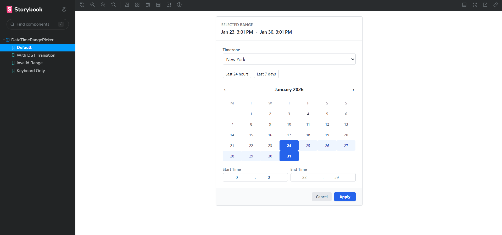

# 🕒 DateTimeRangePicker

A timezone-aware, highly accessible date and time range picker built with **React**, **TypeScript**, and **Tailwind CSS**. Designed for complexity, it handles DST transitions, custom constraints, and responsive layouts with ease.


## 🖥️ Live Demo

Check out the live portfolio here:  [🔗 View live demo ](https://datetimee-rangepickerr.vercel.app/?path=/story/datetimerangepicker--default)

--- 



## ✨ Features

- 🌍 **Timezone Aware**: Seamless switching between timezones with DST-safe conversions.
- ⌨️ **Keyboard Navigation**: Full calendar grid and input control via keyboard.
- 🛑 **Smart Constraints**: Support for `min`/`max` dates, blackout periods, and duration limits.
- ⚡ **Presets**: Quick-select options for common ranges (e.g., "Last 24h", "Last 7 Days").
- ♿ **Accessible**: Full ARIA semantics and screen reader support (A11y).
- 📦 **Zero Dependencies**: Built without external date picker libraries for maximum control.

## 🚀 Getting Started

### Prerequisites

- Node.js (v16+)
- npm or yarn

### Installation

1. Clone the repository:
   ```bash
   git clone <repository-url>
   cd date-time-range-picker
   ```

2. Install dependencies:
   ```bash
   npm install
   ```

3. Start development server:
   ```bash
   npm run dev
   ```

4. Run Storybook to explore components:
   ```bash
   npm run storybook
   ```

## 🛠 Usage

```tsx
import { DateTimeRangePicker } from './src/DateTimeRangePicker';

const MyComponent = () => {
  const [range, setRange] = useState({
    start: null,
    end: null,
    timezone: 'UTC'
  });

  return (
    <DateTimeRangePicker
      value={range}
      onChange={setRange}
      constraints={{
        min: new Date(),
        max: new Date(Date.now() + 30 * 24 * 60 * 60 * 1000)
      }}
    />
  );
};
```

## 🧪 Testing & Quality

- **Unit Tests**: `npm test` (Powered by Vitest)
- **Linting**: `npm run lint`
- **Type Checking**: `npm run typecheck`
- **Accessibility**: Verified via Storybook A11y addon. See [Accessibility Report](file:///c:/Users/JAY/task1/date-time-range-picker/docs/accessibility-report.md).

## 🌐 Deployment

This project is configured for easy deployment on **Vercel**.

1. Connect your repository to Vercel.
2. Vercel will automatically detect the Vite framework.
3. Use the following build settings:
   - **Build Command**: `npm run build`
   - **Output Directory**: `dist`
   - **Framework Preset**: `Vite`

Alternatively, you can deploy using the [Vercel CLI](https://vercel.com/docs/cli):
```bash
npx vercel
```

## 📄 API Documentation

For a full list of props and advanced configurations, refer to the [API Docs](file:///c:/Users/JAY/task1/date-time-range-picker/docs/api-docs.md).
